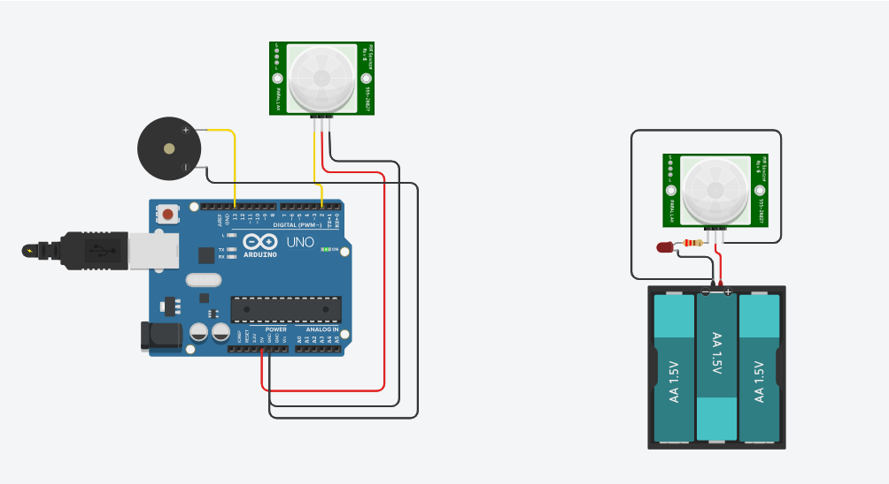

# Projetos de Arduino

Este repositório contém os arquivos de um site dedicado a **projetos de Arduino para iniciantes**, oferecendo tutoriais e exemplos práticos para quem deseja começar a montar circuitos e programar com Arduino.

## 🚀 Sobre o Projeto

O site "Projetos de Arduino" tem como objetivo principal ser um recurso educacional e prático para o aprendizado de eletrônica e programação básica com a plataforma Arduino. Ele foi desenvolvido para ser intuitivo e acessível, com foco em projetos que podem ser replicados facilmente por estudantes e entusiastas.

### 💡 Relevância para o Hackathon da Receita Federal

Este projeto foi desenvolvido no contexto do **Hackathon da Receita Federal**, com foco na temática de **reutilização de componentes de vapes**. Embora o site apresente projetos de Arduino de uso geral, a proposta subjacente é capacitar indivíduos com o conhecimento em eletrônica e programação necessário para, futuramente, **desmontar e reutilizar componentes eletrônicos presentes em vapes e outros dispositivos descartados**, promovendo a sustentabilidade e a economia circular através da inovação. Os projetos básicos aqui servem como uma base de aprendizado para aplicações mais complexas e focadas na reutilização.

## ✨ Funcionalidades e Projetos Destacados

A plataforma apresenta uma série de projetos, cada um com uma descrição concisa e um link para um tutorial mais detalhado (dentro da estrutura do site). Alguns dos projetos que você encontrará incluem:

* **Detector de Movimento**: Crie um sistema que acende um LED quando detectar movimento.
* **Mini Lanterna com LED**: Aprenda a criar uma lanterna simples controlada por botão.
* **Semáforo com LEDs**: Monte um semáforo em miniatura com LEDs coloridos.
* **Sensor de Luminosidade com LDR**: Crie um sistema que acende um LED quando o ambiente fica escuro.
* **Display LCD com Mensagens**: Aprenda a exibir mensagens e informações em um display LCD.
* **Controle de Servo Motor**: Controle a posição de um servo motor com precisão.
* **Medidor de Distância**: Meça distâncias com precisão usando um sensor ultrassônico.
* **Termômetro Digital**: Crie um termômetro para medir a temperatura ambiente.
* **Jogo de Reação com Botões**: Teste seus reflexos com este jogo simples e divertido.

## 🤝 Como Contribuir (Compartilhar Seu Projeto)

O site incentiva a colaboração da comunidade! Se você desenvolveu um projeto de Arduino interessante e gostaria de compartilhá-lo com outros alunos e professores, existe uma seção dedicada para isso.

Para compartilhar seu projeto, visite a página:
[Compartilhar Meu Projeto](Aluno/compartilhar-projeto.html)

## 🛠️ Tecnologias Utilizadas

* **HTML5**: Estrutura da página.
* **CSS3**: Estilização (através de `css/style.css`).
* **Google Fonts**: Fonte 'Roboto' para uma tipografia agradável.
* **Tinkercad**: Modelos de Projetos.
---
Feito com ❤️ para a comunidade Arduino.
